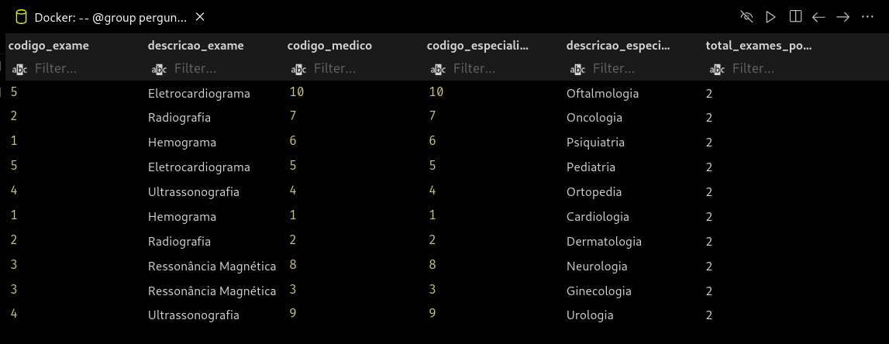
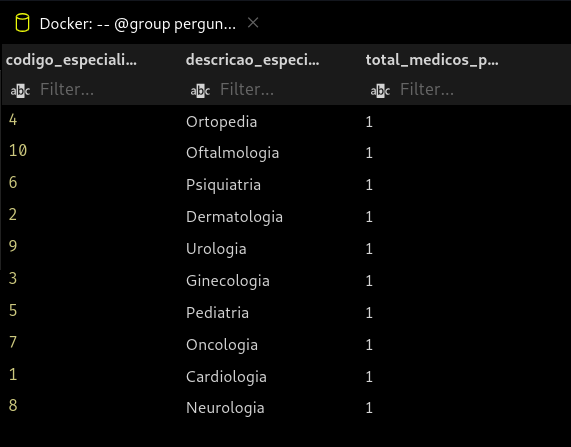
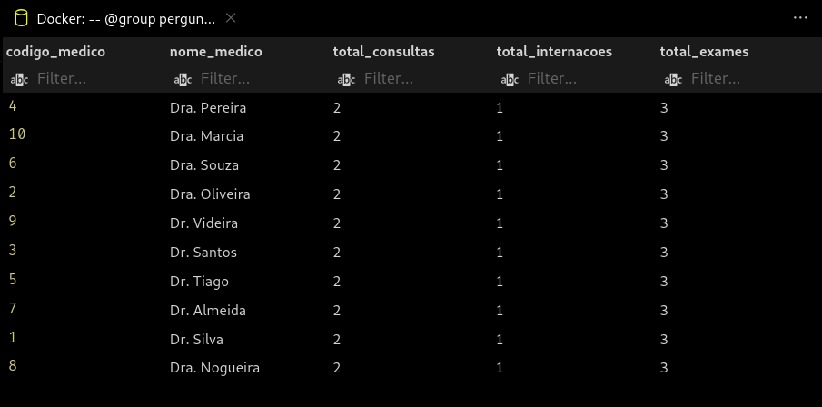
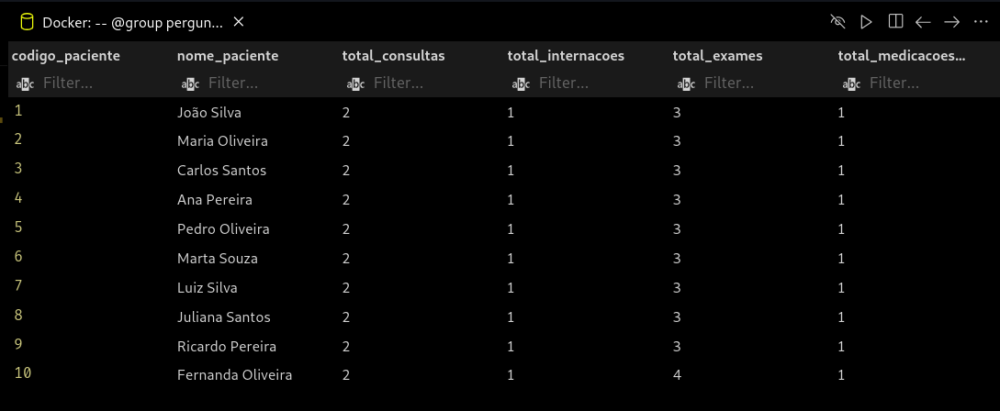
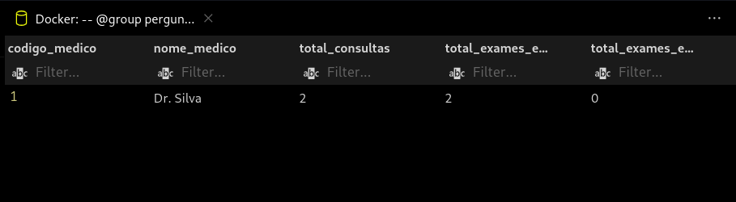
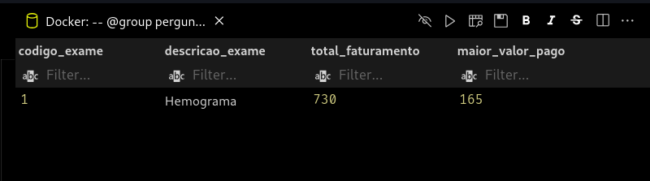
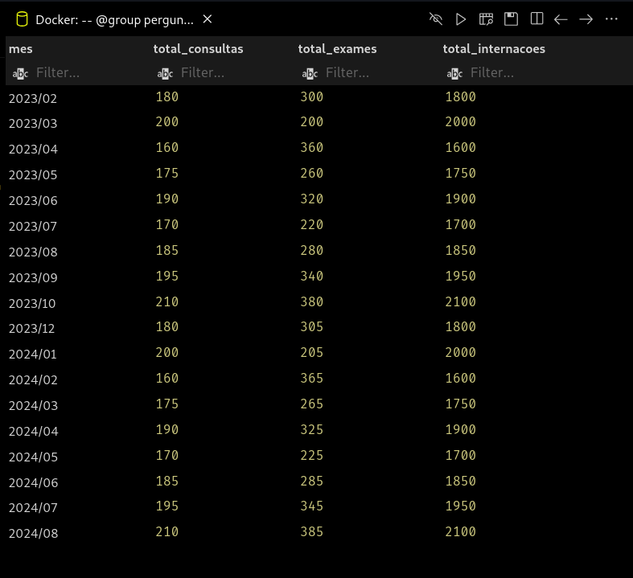

# Respostas das questões 20 a 28

## Questão 20

Fazer uma consulta com a estatística de exames solicitados, ou seja a quantidade de solicitações por exames cadastrados.(lembrando que exames podem ser solicitados em consultas ou em prontuários de internação).

```sql
-- @block Bookmarked query
-- @group Sistema Hospitalar
-- @name pergunta 20 v5 final (consolidando consultas e internações)
with total_geral_exames as (
    select count(*) + (
            select count(*)
            from exame_internacao
        ) as total
    from exame_consulta
),
total_exames_consulta as (
    select t1.codigo as codigo_exame,
        t1.descricao as descricao_exame,
        count(*) as total_exames_por_tipo
    from consulta as c1,
        exame_consulta as e1,
        tipo_exame as t1
    where (
            c1.codigo_paciente = e1.codigo_paciente
            and c1.codigo_convenio = e1.codigo_convenio
            and c1.codigo_medico = e1.codigo_medico
            and c1.codigo_especialidade = e1.codigo_especialidade
            and c1.data_hora = e1.data_consulta
            and t1.codigo = e1.codigo_tipo_exame
        )
    group by t1.codigo
    order by t1.descricao
),
total_exames_internacao as (
    select t1.codigo as codigo_exame,
        t1.descricao as descricao_exame,
        count(*) as total_exames_por_tipo
    from internacoes as i1,
        exame_internacao as e2,
        tipo_exame as t1
    where (
            i1.codigo = e2.codigo_internacao
            and t1.codigo = e2.codigo_tipo_exame
        )
    group by t1.codigo
    order by t1.descricao
)
select codigo_exame as codigo,
    descricao_exame as descricao,
    sum(total_exames_por_tipo) as total
from (
        select *
        from total_exames_consulta
        union all
        select *
        from total_exames_internacao
    ) as sq
group by descricao,
    codigo
order by descricao;
--
```


## Questão 21

Listar os médicos da especialidade que teve maior número de consulta

```sql
-- @block Sistema Hospitalar
-- @group pergunta 21 v2 final
-- @description Listar os médicos da especialidade que teve maior número de consulta
select t1.codigo as codigo_exame,
    t1.descricao as descricao_exame,
    c1.codigo_medico as codigo_medico,
    c1.codigo_especialidade as codigo_especialidade,
    e2.descricao as descricao_especialidade,
    count(*) as total_exames_por_especialidade
from consulta as c1,
    exame_consulta as e1,
    tipo_exame as t1,
    especialidades as e2
where (
        c1.codigo_paciente = e1.codigo_paciente
        and c1.codigo_convenio = e1.codigo_convenio
        and c1.codigo_medico = e1.codigo_medico
        and c1.codigo_especialidade = e1.codigo_especialidade
        and c1.codigo_especialidade = e2.codigo
        and c1.data_hora = e1.data_consulta
        and t1.codigo = e1.codigo_tipo_exame
    )
group by c1.codigo_medico,
    c1.codigo_especialidade,
    t1.codigo,
    e2.descricao,
    t1.codigo
order by total_exames_por_especialidade;
```



## Questão 22

Fazer uma consulta com a estatística de médicos por especialidade, ou seja a quantidade de médicos por especialidade.

```sql
-- @block Sistema Hospitalar
-- @group pergunta 22 v2 final
-- @description Fazer uma consulta com a estatística de médicos por especialidade, ou seja a quantidade de médicos por especialidade.
select e2.codigo as codigo_especialidade,
    e2.descricao as descricao_especialidade,
    count(*) as total_medicos_por_especialidade
from especialista as e1,
    medicos as m1,
    especialidades as e2
where (
        e1.codigo_medico = m1.codigo
        and e1.codigo_especialidade = e2.codigo
    )
group by e2.codigo;
```



## Questão 23

Fazer uma consulta com a estatística de quantos exames, internações e consultas realizadas por médico, ou seja listar: médico, totalexames, totalinternacoes, totalconsultas.

```sql
-- @block Sistema Hospitalar
-- @group pergunta 23 v2 final
-- @description Fazer uma consulta com a estatística de quantos exames, internações e consultas realizadas por médico, ou seja listar: médico, totalexames, totalinternacoes, totalconsultas.
with medicos_consulta as (
    select m1.codigo as codigo_medico,
        count(*) as total_consultas
    from consulta as c1,
        medicos as m1
    where c1.codigo_medico = m1.codigo
    group by m1.codigo
),
medicos_internacao as (
    select m1.codigo as codigo_medico,
        m1.nome as nome_medico,
        count(*) as total_internacoes
    from internacoes as i1,
        medicos as m1
    where i1.codigo_medico = m1.codigo
    group by m1.codigo
),
medicos_exame_consulta as (
    select m1.codigo as codigo_medico,
        m1.nome as nome_medico,
        count(*) as total_exames_consulta
    from exame_consulta as e1,
        medicos as m1
    where e1.codigo_medico = m1.codigo
    group by m1.codigo
),
medicos_exame_internacao as (
    select m1.codigo as codigo_medico,
        m1.nome as nome_medico,
        count(*) as total_exames_internacao
    from exame_internacao as e2,
        internacoes as i1,
        medicos as m1
    where i1.codigo = e2.codigo_internacao
        and i1.codigo_medico = m1.codigo
    group by m1.codigo
),
medicos_exames_totais as (
    select codigo_medico,
        nome_medico,
        sum(total_exames_consulta) as total_exames
    from (
            select *
            from medicos_exame_consulta
            union all
            select *
            from medicos_exame_internacao
        ) as sq
    group by codigo_medico,
        nome_medico
)
select m1.codigo as codigo_medico,
    m1.nome as nome_medico,
    mc.total_consultas as total_consultas,
    mi.total_internacoes as total_internacoes,
    mt.total_exames as total_exames
from medicos as m1,
    medicos_consulta as mc,
    medicos_internacao as mi,
    medicos_exames_totais as mt
where (
        m1.codigo = mc.codigo_medico
        and m1.codigo = mc.codigo_medico
        and m1.codigo = mi.codigo_medico
        and m1.codigo = mt.codigo_medico
    );
```



## Questão 24

Listar os pacientes que já realizaram consultas, exames por consulta e por internação, internação e receberam medicamento em internação.

```sql
-- @block Sistema Hospitalar
-- @group pergunta 24 v3 final
-- @description Listar os pacientes que já realizaram consultas, exames por consulta e por internação, internação e receberam medicamento em internação.
with pacientes_consulta as (
    select m1.codigo as codigo_paciente,
        count(*) as total_consultas
    from consulta as c1,
        pacientes as m1
    where c1.codigo_paciente = m1.codigo
    group by m1.codigo
),
pacientes_internacao as (
    select m1.codigo as codigo_paciente,
        m1.nome as nome_paciente,
        count(*) as total_internacoes
    from internacoes as i1,
        pacientes as m1
    where i1.codigo_paciente = m1.codigo
    group by m1.codigo
),
pacientes_exame_consulta as (
    select m1.codigo as codigo_paciente,
        m1.nome as nome_paciente,
        count(*) as total_exames_consulta
    from exame_consulta as e1,
        pacientes as m1
    where e1.codigo_paciente = m1.codigo
    group by m1.codigo
),
pacientes_exame_internacao as (
    select m1.codigo as codigo_paciente,
        m1.nome as nome_paciente,
        count(*) as total_exames_internacao
    from exame_internacao as e2,
        internacoes as i1,
        pacientes as m1
    where i1.codigo = e2.codigo_internacao
        and i1.codigo_paciente = m1.codigo
    group by m1.codigo
),
pacientes_exames_totais as (
    select codigo_paciente,
        nome_paciente,
        sum(total_exames_consulta) as total_exames
    from (
            select *
            from pacientes_exame_consulta
            union all
            select *
            from pacientes_exame_internacao
        ) as sq
    group by codigo_paciente,
        nome_paciente
),
pacientes_receita_internacao as (
    select p1.codigo as codigo_paciente,
        p1.nome as nome_paciente,
        coalesce(count(r1.data_hora), 0) as total_medicacoes_internacao
    from pacientes as p1
        inner join internacoes as i1 on i1.codigo_paciente = p1.codigo
        left join receita_internacao as r1 on r1.codigo_internacao = i1.codigo
    group by p1.codigo
)
select m1.codigo as codigo_paciente,
    m1.nome as nome_paciente,
    mc.total_consultas,
    mi.total_internacoes,
    mt.total_exames,
    mr.total_medicacoes_internacao
from pacientes as m1,
    pacientes_consulta as mc,
    pacientes_internacao as mi,
    pacientes_exames_totais as mt,
    pacientes_receita_internacao as mr
where (
        m1.codigo = mc.codigo_paciente
        and m1.codigo = mc.codigo_paciente
        and m1.codigo = mi.codigo_paciente
        and m1.codigo = mt.codigo_paciente
        and m1.codigo = mr.codigo_paciente
        and mr.total_medicacoes_internacao > 0
    );
```



## Questão 25

Listar os médicos que já realizaram consultas, solicitaram exames em consultas, e nunca solicitaram exames em internação

```sql
-- @block Sistema Hospitalar
-- @group pre-pergunta 25
-- @description Preparar para base atender ao critério de ter uma tupla como resposta
delete from public.exame_internacao
where codigo = 1;
--
-- @block Sistema Hospitalar
-- @group pergunta 25 v5 final
-- @description Listar os médicos que já realizaram consultas, solicitaram exames em consultas, e nunca solicitaram exames em internação
with medicos_consulta as (
    select m1.codigo as codigo_medico,
        m1.nome as nome_medico,
        coalesce(count(c1.data_hora), 0) as total_consultas
    from medicos as m1
        left join consulta as c1 on c1.codigo_medico = m1.codigo
    group by m1.codigo
),
medicos_exame_consulta as (
    select m1.codigo as codigo_medico,
        m1.nome as nome_medico,
        coalesce(count(ec1.codigo), 0) as total_exames_em_consultas
    from medicos as m1
        left join exame_consulta as ec1 on ec1.codigo_medico = m1.codigo
    group by m1.codigo
),
medicos_exame_internacao as (
    select m1.codigo as codigo_medico,
        m1.nome as nome_medico,
        coalesce(count(ei1.codigo), 0) as total_exames_em_internacoes
    from medicos as m1
        left join internacoes as i1 on i1.codigo_medico = m1.codigo
        left join exame_internacao as ei1 on ei1.codigo = i1.codigo
    group by m1.codigo
)
select m1.codigo as codigo_medico,
    m1.nome as nome_medico,
    mc.total_consultas,
    mec.total_exames_em_consultas,
    mei.total_exames_em_internacoes
from medicos as m1,
    medicos_consulta as mc,
    medicos_exame_consulta as mec,
    medicos_exame_internacao as mei
where (
        m1.codigo = mc.codigo_medico
        and m1.codigo = mec.codigo_medico
        and m1.codigo = mei.codigo_medico
        and mec.total_exames_em_consultas > 0
        and mei.total_exames_em_internacoes = 0
    );
```



## Questão 26

Listar os médicos que menos solicitaram exames.

```sql
-- @block Sistema Hospitalar
-- @group pergunta 26 v3 Final
-- @description Listar os médicos que menos solicitaram exames.
with medico_exame_consulta as (
    select m1.codigo as codigo_medico,
        m1.nome as nome_medico,
        coalesce(count(ec1.codigo), 0) as total_exames_consultas
    from medicos as m1
        left join exame_consulta as ec1 on ec1.codigo_medico = m1.codigo
    group by m1.codigo
),
medico_exame_internacao as (
    select m1.codigo as codigo_medico,
        m1.nome as nome_medico,
        coalesce(count(ei1.codigo), 0) as total_exames_internacoes
    from medicos as m1
        left join internacoes as i1 on i1.codigo_medico = m1.codigo
        left join exame_internacao as ei1 on ei1.codigo = i1.codigo
    group by m1.codigo
),
medicos_exames_totais as (
    select codigo_medico,
        nome_medico,
        sum(total_exames_consultas) as total_exames
    from (
            select *
            from medico_exame_consulta
            union all
            select *
            from medico_exame_internacao
        ) as sq
    group by codigo_medico,
        nome_medico
)
select codigo_medico,
    nome_medico,
    total_exames
from medicos_exames_totais
where total_exames < (
        select avg(total_exames)
        from medicos_exames_totais
    );
```


## Questão 27

Faça vocês do grupo uma pergunta que necessite utilizar funções agregadas e subconsulta para obter a resposta.

Pergunta: Consultar o faturamento total em exames de tipo 'hemograma' e o maior valor pago para realizar este exame.

```sql
-- @block Sistema Hospitalar
-- @group pergunta 27 v3 final
-- @description Faça vocês do grupo uma pergunta que necessite utilizar funções agregadas e subconsulta para obter a resposta.
-- @notes Pergunta: Consultar o faturamento total em exames de tipo 'hemograma' e o maior valor pago para realizar este exame.
select e3.codigo as codigo_exame,
    e3.descricao as descricao_exame,
    sum(e3.valor) as total_faturamento,
    max(e3.valor) as maior_valor_pago
from (
        select t1.codigo as codigo,
            t1.descricao as descricao,
            e1.valor as valor
        from exame_consulta as e1,
            tipo_exame as t1
        where t1.codigo = e1.codigo_tipo_exame
        union all
        select t2.codigo as codigo,
            t2.descricao as descricao,
            e2.valor as valor
        from exame_internacao as e2,
            tipo_exame as t2
        where t2.codigo = e2.codigo_tipo_exame
    ) as e3 --
where e3.codigo = 1 -- 'Hemograma'
group by e3.codigo,
    e3.descricao
order by e3.descricao;

```



## Questão 28

Fazer uma consulta que liste o faturamento por mês separado por consulta, exame e internações. Formato de saída: Mês, valorTotalConsultas, ValorTotalExames, ValorTotalInternações.

```sql
-- @block Sistema Hospitalar
-- @group pergunta 28 v2 final
-- @description Fazer uma consulta que liste o faturamento por mês separado por consulta, exame e internações.Formato de saída: Mês, valorTotalConsultas, ValorTotalExames, ValorTotalInternações.
select to_char(c1.data_hora, 'YYYY/MM') as mes,
    sum(e1.valor) as total_consultas,
    sum(ec1.valor + ei1.valor) as total_exames,
    sum(i1.valor) as total_internacoes
from consulta as c1,
    especialidades as e0,
    especialista_conveniado as e1,
    internacoes as i1,
    exame_consulta as ec1,
    exame_internacao as ei1
where (
        e0.codigo = c1.codigo_especialidade
        and e1.codigo_convenio = c1.codigo_convenio
        and e1.codigo_medico = c1.codigo_medico
        and e1.codigo_especialidade = c1.codigo_especialidade
        and i1.codigo_paciente = c1.codigo_paciente
        and ec1.codigo_paciente = c1.codigo_paciente
        and ec1.codigo_convenio = c1.codigo_convenio
        and ec1.codigo_medico = c1.codigo_medico
        and ec1.codigo_especialidade = c1.codigo_especialidade
        and ec1.data_consulta = c1.data_hora
        and ei1.codigo_internacao = c1.codigo_paciente
    )
group by c1.data_hora,
    e0.descricao
order by c1.data_hora;
```


